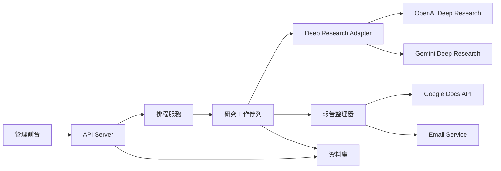

# 週報管理工具設計藍圖

## 1. 核心流程

1. 管理者建立週報任務
2. 設定頻率、資料區間、收件人、研究提供者與完整提示詞
3. 排程時間到達後，由後端建立一次研究工作
4. 呼叫 Deep Research 服務進行分析
5. 研究完成後，將結果整理成 Google Doc
6. 將 Google Doc 連結透過 Email 寄給指定收件人
7. 前台保留執行紀錄、狀態、錯誤與重試能力

## 2. 建議功能

### MVP

- 週報任務 CRUD
- 頻率設定：每週、每月、自訂
- 區間設定：最近 N 天、本週、上週、自訂日期
- 完整提示詞編輯器
- Deep Research 提供者切換：OpenAI / Gemini
- 手動立即執行
- 研究狀態追蹤
- Google Doc 產生
- Email 發送
- 執行歷史與錯誤紀錄

### 第二階段

- 提示詞模板庫
- 多收件群組
- 報告格式模板
- 來源白名單 / 黑名單
- 內部知識庫檢索
- 審核後再寄送
- 報告差異比較
- 成本與耗時分析

## 3. 推薦架構

## 4. 建議資料表

### `report_jobs`

- `id`
- `name`
- `provider`
- `schedule_type`
- `schedule_rule`
- `date_range_mode`
- `prompt`
- `recipient_list`
- `enabled`
- `created_at`
- `updated_at`

### `report_runs`

- `id`
- `job_id`
- `status`
- `scheduled_at`
- `started_at`
- `finished_at`
- `provider_run_id`
- `google_doc_id`
- `google_doc_url`
- `email_status`
- `error_message`

## 5. 提供者選型

### OpenAI

- 適合：
  - 需要高品質長篇分析
  - 需要成熟的引用輸出
  - 未來可能串接內部資料來源
- 注意：
  - API 端需要自行補上提示詞澄清或重寫流程
  - 長任務建議走背景模式與 webhook

### Gemini

- 適合：
  - 希望與 Google 生態更貼近
  - 想利用合作式研究規劃與視覺化輸出
  - 團隊本來就大量使用 Google Cloud / Workspace
- 注意：
  - Deep Research Agent 仍屬 preview
  - 需要使用 Interactions API，不是一般 `generate_content`

## 6. 最務實的技術組合

- 前端：React + Vite
- 後端：Node.js / NestJS 或 Python / FastAPI
- 排程：Cloud Scheduler + Queue，或 BullMQ / Celery
- 資料庫：PostgreSQL
- 認證：Google OAuth 2.0
- 文件：Google Docs API
- 郵件：Gmail API 或企業 SMTP
- 研究層：抽象成 `ResearchProvider`，底下接 OpenAI / Gemini

## 7. 建議先做的版本

先做 `OpenAI + Google Docs + Gmail`：

- OpenAI Deep Research 的正式文件較完整
- Google Docs / Gmail API 都已有成熟 REST 介面
- 架構上保留 provider abstraction，之後再補 Gemini adapter

## 8. 前台原型

目前前端原型已包含：

- 任務列表
- 任務設定
- 提供者切換
- 最近一次執行狀態
- Google Doc 與 Email 輸出結果
